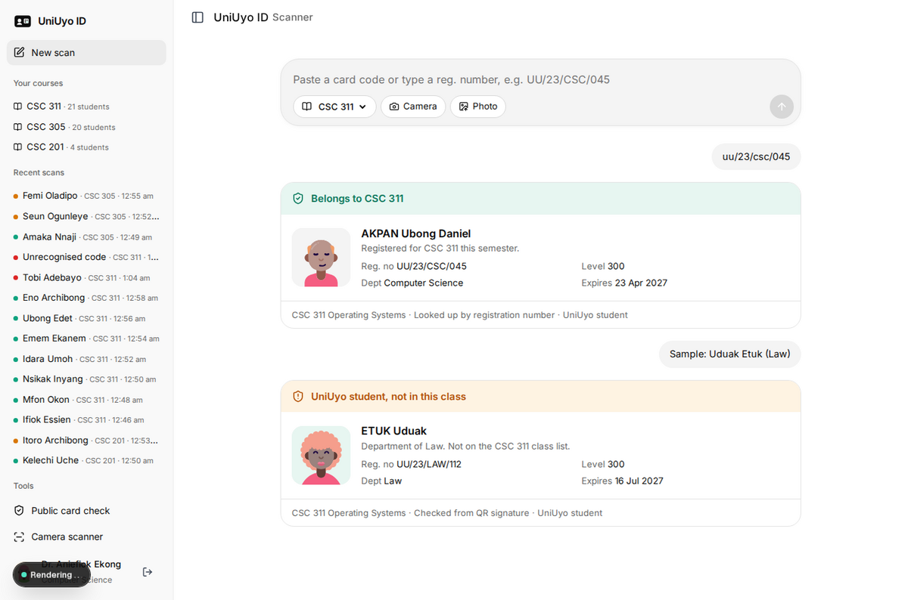

# UniUyo ID

Digital student ID cards with QR verification for the University of Uyo. Each student in the existing register gets an ID card with a signed QR code. A lecturer scans it and immediately sees whether the person is a UniUyo student and whether they belong to the class being taught.



Full documentation with annotated screenshots: [docs/UniUyo-ID-Documentation.pdf](docs/UniUyo-ID-Documentation.pdf)

## Features

- Student ID card (front and back) with photo, registration number, department, level, expiry and a QR code, plus registered courses; printable
- QR codes carry an HMAC signature, so they cannot be forged or edited; reissuing a card (a new card version) invalidates the old QR
- Lecturer checkpoint per class: camera viewport (jsQR in the browser), photo upload, pasted code or typed registration number, with live admitted and flagged counters
- One answer per scan: green when the student is registered for the course; amber for a UniUyo student from the same or another department who is not on the class list, or an expired card; red for a forged code, an unknown or suspended student, or a replaced card
- Attendance register per class (present today, card problems) and a scan log filtered by result or course
- Student ID wallet: a security-printed card that flips and shows its QR full screen with a live clock
- Download and print page: the card at actual size (85.6 x 54 mm) with crop marks, a print-ready A4 PDF, and front and back as 1012 x 638 PNG images (300 dpi)
- Public card check page for anyone who scans the QR with a phone camera
- Every query is scoped to the signed-in lecturer or student

## Demo logins

| Role | Email | Password |
| --- | --- | --- |
| Lecturer (CSC 311, CSC 305, CSC 201) | lecturer@uniuyo.edu.ng | lecturer123 |
| Student in CSC 311 | student@uniuyo.edu.ng | student123 |
| Law student (not in CSC 311) | uduak.etuk@student.uniuyo.edu.ng | student123 |

The login page is prefilled with the lecturer account and has one-click buttons for the others.

## Tech stack

Next.js 16 (App Router, Server Components, Server Actions), TypeScript (strict), Drizzle ORM with PostgreSQL and drizzle-kit migrations, Zod, bcryptjs and jose sessions, qrcode and jsQR, lucide-react icons, DiceBear portraits, Fontsource (Inter), Vitest and Playwright.

## Quick start

```bash
service postgresql start
sudo -u postgres createdb uniid
sudo -u postgres createdb uniid_test
cp .env.example .env    # set DATABASE_URL and SESSION_SECRET
npm install
npm run db:migrate
npm run db:seed
npm run dev             # http://localhost:3000
```

Set `UNIID_TODAY=2026-10-05` to freeze the clock. The camera needs HTTPS or localhost.

## Scripts

| Script | What it does |
| --- | --- |
| `npm run dev` | Development server |
| `npm run build` / `npm start` | Production build and server |
| `npm run start:prod` | Migrate, seed if empty, start on 0.0.0.0 (Railway) |
| `npm run db:generate` / `db:migrate` / `db:seed` | New migration, apply, reset and seed |
| `npm run test:unit` / `test:integration` / `test:e2e` | Test suites |
| `npm run docs:pdf` | Rebuild the PDF documentation |

## Deployment

Railway project `school-projects`, service `uni-digital-id` with its own `uni-digital-id-postgres` database. `railway.json`: build `npm run build`, start `npm run start:prod`, health check `/api/health` (pings the database). `SESSION_SECRET` also keys the QR signatures, so changing it invalidates every printed QR code.

## Image credits

Campus photos are Creative Commons images found through Openverse (credits in `public/images/credits.json`). Student photos are generated portraits, not real people.
